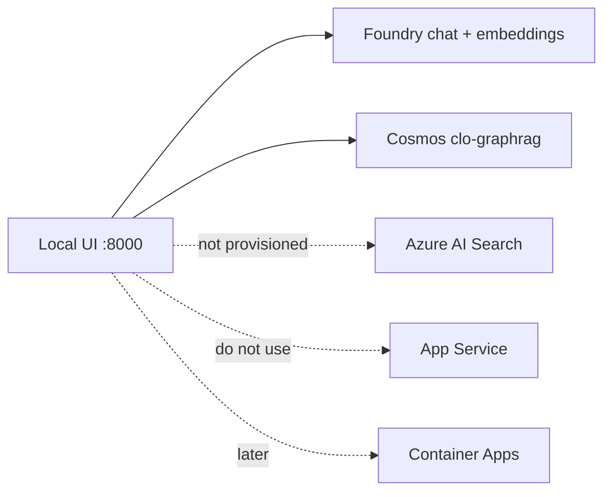

# Azure Deployment Plan

> **Status:** Phase 1 complete locally. Phase 2 graph + Ask + waterfall running locally against existing Cosmos and Foundry. No new Azure provision in this pass. App Service remains blocked.

Updated: 2026-09-03

---

## 1. Project Overview

**Goal:** CLO Document Intelligence on Azure: ingest trustee reports, indentures, offering memoranda, and rating reports; extract layout/tables; map fields to a canonical schema; GraphRAG; grounded Ask; indenture waterfall; later an agent query layer.

**Path:** Existing repo (`clo_intel` + `web/`). Sample book is 22 fictional deals / 66 PDFs.

**Product phases:**

| Phase | Status |
|-------|--------|
| 1 Extraction + HITL | Done locally |
| 2 Knowledge graph + Ask + waterfall | In progress (Cosmos yes, Azure AI Search no) |
| 3 Foundry agent tools | Stub only — do not build yet |
| 4 Production (CI/CD, Container Apps) | Not started |

No `azd up` in this pass (App Service VM quota in eastus2 is 0). Stay local until Container Apps IaC exists.

How the desk works: [`README.md`](../README.md). Target architecture: [`docs/architecture.md`](../docs/architecture.md).

---

## 2. Requirements

| Attribute | Value |
|-----------|-------|
| Classification | Development / POC toward production |
| Scale | Small (sample CLO book; spiky document-arrival later) |
| Budget | Cost-optimized (reuse Foundry + Cosmos; serverless later) |
| **Subscription** | Azure subscription 1 (`3fc99a76-c448-4a6e-b802-2fb7f6085a06`) |
| **Location** | eastus2 |
| **Resource group** | `rg-saumilsheth-2906` |

---

## 3. Components Detected

| Component | Type | Technology | Path |
|-----------|------|------------|------|
| Pipeline orchestrator | Worker | Python 3.11 | `src/clo_intel/pipeline.py` |
| Extraction | Worker | Document Intelligence + PyMuPDF fallback | `src/clo_intel/extract.py` |
| Contextualization | Worker | Azure AI Foundry (`Kimi-K2.6`) | `src/clo_intel/contextualize.py` |
| Sample book + PDFs | Data | Python + fpdf2 | `src/clo_intel/sample_book.py`, `scripts/generate_sample_pdfs.py` |
| Graph + Ask | API | Cosmos + graph facts | `src/clo_intel/graph.py`, `answer.py` |
| Indenture waterfall | Code | Actual/360 sequential | `src/clo_intel/waterfall.py` |
| Review API + UI | API / Frontend | FastAPI + `web/` | `src/clo_intel/api.py`, `web/` |
| Structured store | Data | Local JSON runs; HITL `data/reviews.json` | `src/clo_intel/store.py`, `review.py` |
| Hybrid search | Local index | Keyword + embeddings, RRF | `src/clo_intel/search.py` |
| Phase 3 agent | Stub | Placeholder | `src/clo_intel/phases.py` |

---

## 4. Recipe Selection

**Selected:** Bicep (single-cloud Azure), not AZD in this pass.

**Rationale:** Architecture specifies Bicep. App Service quota blocked PaaS web SKUs. Glue runs locally. Container Apps + Functions Bicep before azure-validate; not deployed now.

---

## 5. Architecture

**Stack today:** in-process pipeline + uvicorn UI + existing Foundry and Cosmos.

**Stack later:** Event Grid + Durable Functions ingest; Container Apps for API; Azure AI Search for vectors.

### Service Mapping

| Component | Azure Service | SKU / notes | Used now |
|-----------|---------------|-------------|----------|
| Source PDFs | Blob / ADLS Gen2 later | Local `data/pdfs` | Local files |
| Ingestion | Event Grid + Durable Functions | Stubbed | `clo_intel run` |
| Layout / tables | Azure AI Document Intelligence | `prebuilt-layout`; PyMuPDF fallback | Yes / fallback |
| Contextualization | Azure AI Foundry | Project `saumilsheth-7860`, chat `Kimi-K2.6`, embeddings `text-embedding-3-small` | Yes |
| Graph store | Cosmos DB NoSQL `clo-graphrag` | Database `graph_rag`, container `graph` (`/pk`) | Yes |
| Vector index | Azure AI Search | Not provisioned | Local `data/index.json` |
| Agent | Foundry Agent Service | Stub tools only | No |
| Guardrails | Azure AI Content Safety | Adapter + Pydantic | Schema / HITL |
| API | Container Apps later | Local uvicorn | Local |
| Observability | App Insights | Structured logs now | Logs |

### Supporting Services

| Service | Purpose |
|---------|---------|
| Log Analytics | Unified logs (Phase 4) |
| Application Insights | Traces with document/deal/stage |
| Key Vault | Secrets (Managed Identity preferred) |
| Managed Identity | Service-to-service auth |

---

## 6. Provisioning Limit Checklist

**No new Azure resources in this iteration.** Existing:

| Resource Type | Deploy now | After | Limit/Quota | Notes |
|---------------|------------|-------|-------------|-------|
| Microsoft.DocumentDB/databaseAccounts | 0 (`clo-graphrag` exists) | 1 | 50 / region | Reuse |
| Microsoft.CognitiveServices/accounts (Foundry) | 0 (`saumilsheth-7860-resource` exists) | 1 | subscription quota | Reuse chat + embeddings |
| Microsoft.Web/serverfarms (App Service) | 0 | 0 | **Total VMs = 0 in eastus2** | Do not use App Service |
| Microsoft.App/containerApps | 0 | 0 | — | Deferred |
| Microsoft.Search/searchServices | 0 | 0 | — | **Next Azure resource if continuing Phase 2** |
| Microsoft.Storage/storageAccounts | 0 | existing if any | 250 / region | Local files |

**Status:** Cosmos + Foundry reused. App Service blocked. Next Azure wave: **Azure AI Search**, then Container Apps — not App Service.

---

## 7. Execution Checklist

### Planning
- [x] Analyze workspace
- [x] Gather requirements
- [x] Confirm subscription and location
- [x] Resource inventory
- [x] Quota notes (App Service VMs = 0)
- [x] Select Bicep recipe
- [ ] **User approved Azure provision** (not requested)

### Built locally
- [x] Phase 1 pipeline + HITL UI
- [x] Sample book (22 deals) + PDF generation
- [x] Cosmos graph backfill
- [x] Ask grounded in graph + executive summary
- [x] Indenture disbursement schedule + waterfall
- [x] HITL values drive waterfall and Ask
- [ ] Azure AI Search
- [ ] Production Bicep / Dockerfiles / azure-validate

---

## 8. Files

| File | Purpose | Status |
|------|---------|--------|
| `.azure/deployment-plan.md` | This plan | ✅ current |
| `docs/architecture.md` | Target + as-built | ✅ current |
| `README.md` | How to run + workflows | ✅ current |
| `infra/main.bicep` | Production IaC | ⏳ later |
| `azure.yaml` | AZD | ⏳ later |

---

## 9. Next Steps

> Current: local Phase 1 + partial Phase 2. Do not start Phase 3 yet.

1. **Azure AI Search** — replace local hybrid retrieval (remaining Phase 2).
2. When sharing the UI: Container Apps + Bicep, not App Service.
3. Phase 3 agent tools only after Search exists and Foundry tool-calling is reliable.
4. Optional desk feature: persist “confirm this payment” snapshots.
