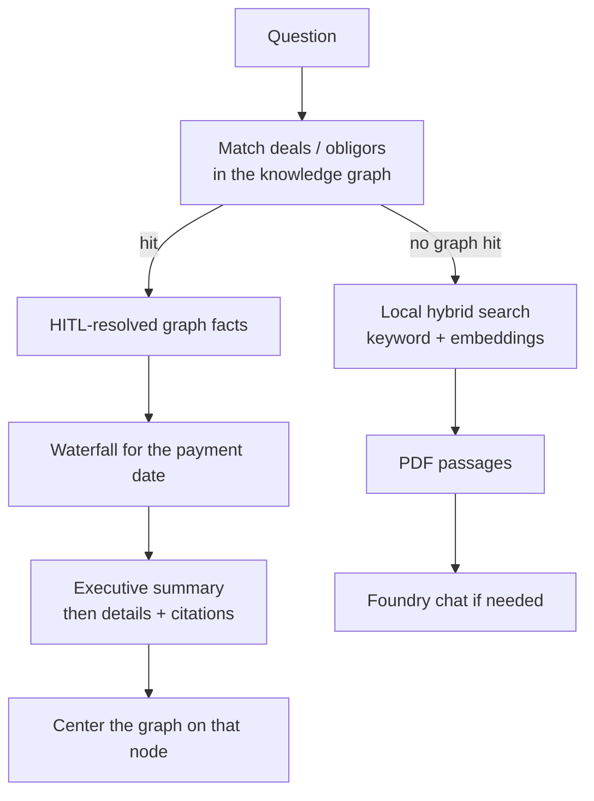
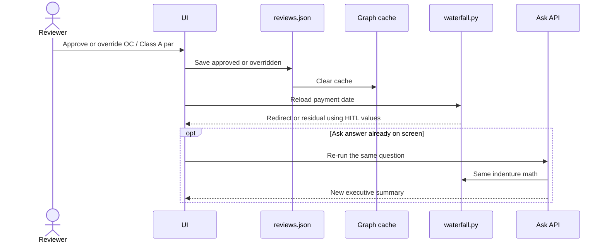
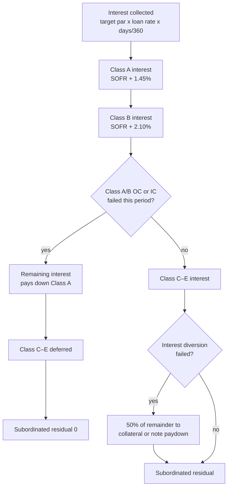

# CLO Document Intelligence

Local credit desk for **fictional CLO sample documents**: extract fields from PDFs, review dollar amounts and OC ratios with a human in the loop, walk a knowledge graph, ask grounded questions, and see the indenture **payment waterfall** for each deal.

Azure is used for Foundry chat/embeddings and Cosmos NoSQL. The review UI runs on your machine. **Do not use App Service** in this subscription: eastus2 VM quota is 0. Host later on Container Apps.

| Phase | Intent | Status |
|-------|--------|--------|
| 1 | Ingest → extract → schema → HITL | **Done** (local) |
| 2 | Knowledge graph, Ask, disbursement | **In progress** — Cosmos graph, HITL overlay, Ask, waterfall UI. Azure AI Search not provisioned; retrieval is local hybrid search. |
| 3 | Foundry agent tool-calling | **Not started** (stub). Do not build until AI Search and a reliable tool-calling model are in place. |
| 4 | CI/CD, Container Apps, full guardrails | **Not started** |

Target cloud architecture: [`docs/architecture.md`](docs/architecture.md). Azure plan: [`.azure/deployment-plan.md`](.azure/deployment-plan.md).

---

## What you can do in the UI

Open **http://127.0.0.1:8000** after `serve`. Three columns:

1. **Left** — Search PDFs, Ask a question, list of documents with open HITL counts.
2. **Center** — Knowledge graph, disbursement schedule / waterfall, PDF page with boxes on numeric fields still waiting for review.
3. **Right** — Resolution dashboard (Open / Approved / Closed) and per-file Approve / Edit for money and OC ratios.

Ask leads with an **executive summary**, then details with clickable citations. After Ask, the graph focuses the matching deal or obligor (for example Apex or Redrock). Approve or override an OC ratio and the **same waterfall** refreshes in the schedule panel and in Ask.

---

## Visual workflows

### Credit desk (as built)

```mermaid
flowchart LR
  pdfs[Sample PDFs<br/>data/pdfs] --> run[clo_intel run<br/>extract + schema]
  run --> store[Local runs JSON]
  store --> ui[Review UI :8000]
  book[Sample book<br/>22 deals] --> graph[clo_intel graph]
  store --> graph
  hitl[HITL reviews.json] --> graph
  graph --> cosmos[Cosmos NoSQL<br/>clo-graphrag]
  ui --> ask[Ask]
  ui --> schedule[Disbursement schedule]
  ask --> facts[Graph facts + HITL]
  facts --> water[Indenture waterfall]
  schedule --> water
  hitl --> water
```

### Ask



Graph matches skip the LLM and return structured facts. That avoids empty chat completions on grounded CLO questions.

### HITL → waterfall → Ask



### Indenture waterfall (sample book)

Logic is the language in the term sheets and trustee reports, implemented in `src/clo_intel/waterfall.py` — not invented by the model.



Loans use **SOFR + 3.75%** with a **0.75% SOFR floor** (credit memo). Notes use Actual/360. Sample 3-month SOFR is **5.35%** (the PDFs do not print a fixing). After the reinvestment period, principal amortizes sequentially from Class A; modeled periods do not invent principal collections.

---

## Sample book

22 fictional deals, 66 PDFs (term sheet + credit memo + trustee report each). Source of truth: `src/clo_intel/sample_book.py`. Generate PDFs with `scripts/generate_sample_pdfs.py`.

Overlapping obligors (Apex in six CLOs) support cross-deal Ask. Redrock, Oakmont, and Ashland fail Class A/B OC, which redirects leftover interest to Class A.

---

## Run locally

Python 3.11, Azure CLI signed in for Foundry and Cosmos.

```bash
python3.11 -m venv .venv
source .venv/bin/activate
pip install -e .
python -m clo_intel run      # extract PDFs in data/pdfs
python -m clo_intel graph    # backfill Cosmos from the sample book + HITL
python -m clo_intel serve    # http://127.0.0.1:8000
```

Typical desk session is `serve` only after `run` and `graph` have been done once.

---

## Azure used today

| Resource | Role |
|----------|------|
| Foundry project `saumilsheth-7860` | Chat **Kimi-K2.6**; embeddings **text-embedding-3-small** |
| Cosmos `clo-graphrag` / `graph_rag` | Graph documents (`graph`), plus `documents` and `sessions` |
| Local `data/` | PDFs, extraction runs, HITL `reviews.json`, hybrid search index |

Not provisioned: Azure AI Search, Foundry Agent Service, Container Apps, App Service.

---

## What is not built

- **Reject** on HITL (removed; Approve / Edit only, numeric fields).
- Confidence boxes on the PDF besides pending numeric quotes.
- Azure AI Search (Phase 2 remainder).
- Phase 3 agent tools (`graph_traverse`, `vector_search`, `get_compliance_test`, plus a future `get_disbursement`).
- Production ingest (Blob + Event Grid) and Container Apps deploy.
