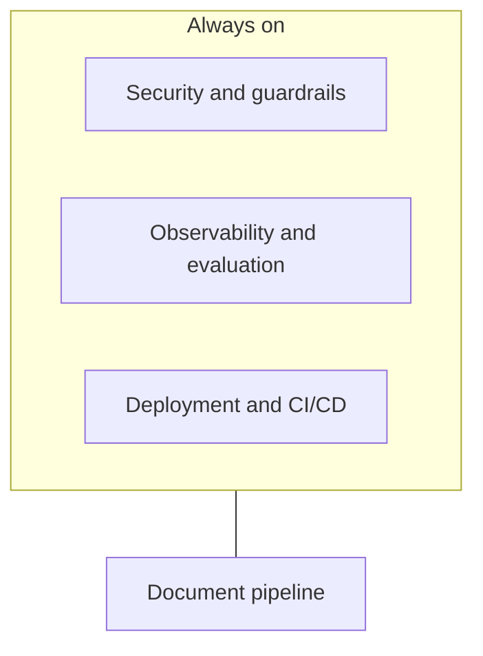

# CLO Document Intelligence — Technical Architecture (Microsoft Azure)

End-to-end extraction, contextualization, and reasoning over CLO documents (trustee reports, indentures, offering memoranda, rating agency reports) using **Microsoft Azure services**, plus security, observability, evaluation, and deployment.

This repo currently implements **Phase 1** (source → ingest → extract → contextualize → structured store + human review). GraphRAG and the agent layer are stubbed for Phases 2–3.

## 1. The core pipeline

```mermaid
flowchart LR
  src[Source PDFs<br/>Blob / ADLS] --> ing[Ingestion<br/>Event Grid / orchestrator]
  ing --> ext[Extraction<br/>Document Intelligence]
  ext --> ctx[Contextualization<br/>Foundry + Language]
  ctx --> graph[GraphRAG<br/>Cosmos + AI Search]
  graph --> intel[Intelligence layer<br/>Foundry Agent]
  intel --> out[Output<br/>API / review UI]
```

| # | Stage | Azure services | What happens |
|---|---|---|---|
| 1 | **Source documents** | Blob Storage (hot), ADLS Gen2 | Raw reports land partitioned by type/trustee/deal. Immutable — never overwritten. |
| 2 | **Ingestion** | Event Grid, Data Factory or Logic Apps, Durable Functions | Blob-created event classifies the document and routes it. Retries, dead-lettering, idempotency. |
| 3 | **Extraction** | Azure AI Document Intelligence (custom + `prebuilt-layout`), Azure AI Vision OCR fallback | Tables and layout with bounding boxes. Output is raw structured JSON per page. |
| 4 | **Contextualization** | Azure OpenAI / Foundry, Azure AI Language | Map fields to a canonical schema, normalize entities, tag PII. |
| 5–6 | **Knowledge graph (GraphRAG)** | Cosmos DB (Gremlin or NoSQL CosmosAIGraph), Azure AI Search, Blob for GraphML | Deals, tranches, obligors, trustees, managers as nodes/edges. Graph walk + vector search. |
| 7 | **Intelligence layer** | Foundry Agent Service (or Semantic Kernel) | Agent chooses graph traversal, vector search, or both; answers grounded in retrieved context. |
| 8 | **Output** | API Management, App Service / Static Web Apps / Container Apps, Power BI | Cited answer or structured extraction; HITL review queue. |

## 2. Cross-cutting layers



### 2a. Security and guardrails

Documents are untrusted input (indirect prompt injection).

- **Prompt Shields** (Azure AI Content Safety) on extracted text before index/graph write, and on the assembled prompt.
- **Content filters** on inputs and outputs.
- **Groundedness detection** for numeric claims (OC/IC ratios).
- **Protected material detection** for offering memoranda.
- **JSON schema validation** (Pydantic) before persist; out-of-range values go to human review.
- **Managed Identities**, Private Endpoints, Key Vault.

### 2b. Harness

The LLM never queries Cosmos or AI Search directly. Tools are typed functions (`graph_traverse`, `vector_search`, `get_compliance_test`). Arithmetic, currency, and schema stay in code.

### 2c. Observability

Azure Monitor + Application Insights with one trace id per document. Structured logs include `document_id`, `deal_id`, and `pipeline_stage`.

### 2d. Evaluation and HITL

- Field precision/recall/F1 against a golden set.
- Table-level alignment checks.
- STP rate per trustee template.
- Foundry Evaluation SDK for groundedness, relevance, retrieval quality.
- Human review for low confidence, schema failures, and a sample of passing results.

### 2e. Deployment

Managed PaaS for AI/data. Containerize the glue (post-process, GraphRAG job, agent tools, API) on **Azure Container Apps** + **ACR**. **Do not use App Service** in this subscription/region until VM quota exists. IaC is **Bicep**. Environments: separate dev/test/prod resource groups.

## 3. Phased rollout

1. **Phase 1 — extraction only** (this repo now): stages 1–4, guardrails/observability, structured store, HITL.
2. **Phase 2 — knowledge graph**: Cosmos + AI Search, backfill, cross-deal queries.
3. **Phase 3 — intelligence layer**: agent, tool-calling, natural-language query.
4. **Phase 4 — production**: CI/CD with eval gating, canary, full guardrails.
