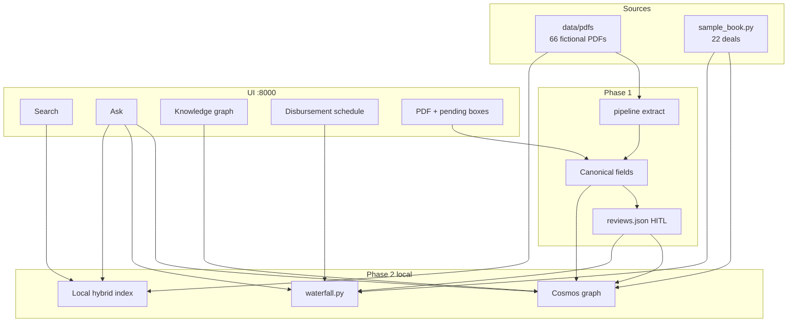
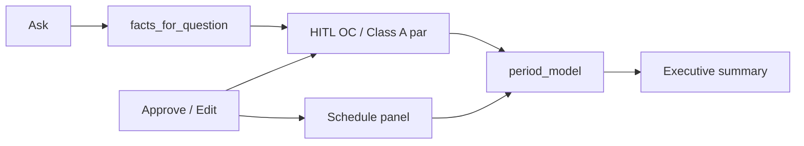
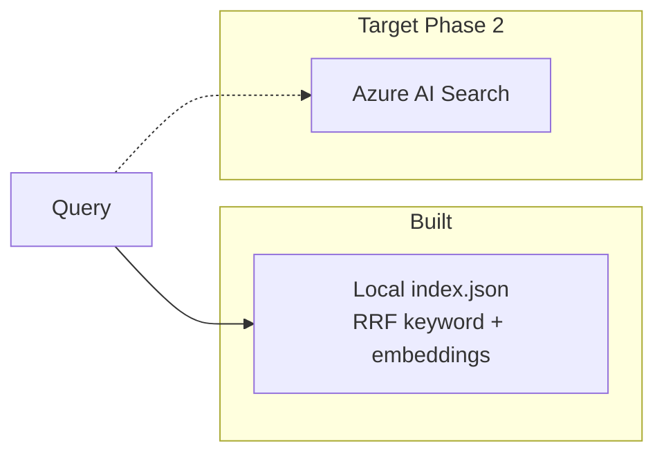
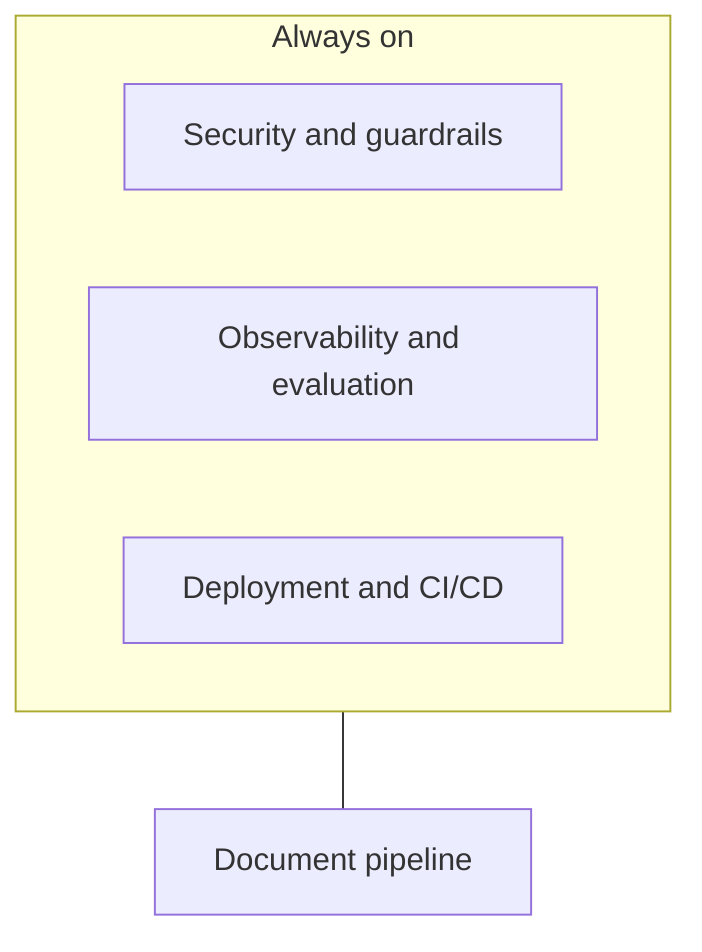

# CLO Document Intelligence — Technical Architecture (Microsoft Azure)

End-to-end extraction, contextualization, and reasoning over CLO documents (trustee reports, indentures, offering memoranda, rating agency reports) using **Microsoft Azure services**, plus security, observability, evaluation, and deployment.

## Status in this repo

| Phase | Architecture intent | Built now |
|-------|---------------------|-----------|
| 1 | Source → ingest → extract → schema → HITL | **Yes**, local PDFs and JSON runs. Document Intelligence with PyMuPDF fallback. HITL is numeric-only (money, OC ratios): Approve or Edit. |
| 2 | GraphRAG in Cosmos + Azure AI Search | **Partial.** Cosmos NoSQL graph + HITL overlay, neighborhood UI, Ask grounded in graph facts, indenture waterfall. Retrieval is **local hybrid search** (keyword + Foundry embeddings). Azure AI Search is **not** provisioned. |
| 3 | Foundry agent with typed tools | **No.** Stub in `src/clo_intel/phases.py`. Ask is a single Python path, not an agent. |
| 4 | CI/CD, Container Apps, full guardrails | **No.** App Service is blocked (eastus2 VM quota 0). |

How to run the desk: [`README.md`](../README.md). Azure provision notes: [`.azure/deployment-plan.md`](../.azure/deployment-plan.md).

---

## As built (local credit desk)



### Ask and HITL share one waterfall



Dollars come from `src/clo_intel/waterfall.py` (Actual/360, sequential interest, OC/IC redirect, 50% diversion). The chat model does not compute coupons.

### Target vs built retrieval



---

## 1. Target Azure pipeline

This is the **production** picture. Several stages are still future work.

```mermaid
flowchart LR
  src[Source PDFs<br/>Blob / ADLS] --> ing[Ingestion<br/>Event Grid / orchestrator]
  ing --> ext[Extraction<br/>Document Intelligence]
  ext --> ctx[Contextualization<br/>Foundry + Language]
  ctx --> graph[GraphRAG<br/>Cosmos + AI Search]
  graph --> intel[Intelligence layer<br/>Foundry Agent]
  intel --> out[Output<br/>API / review UI]
```

| # | Stage | Azure services | What happens | This repo |
|---|---|---|---|---|
| 1 | **Source documents** | Blob Storage (hot), ADLS Gen2 | Raw reports partitioned by type/trustee/deal. Immutable. | Local `data/pdfs/` |
| 2 | **Ingestion** | Event Grid, Data Factory or Logic Apps, Durable Functions | Classify, route, retry, idempotency. | `clo_intel run` in-process |
| 3 | **Extraction** | Azure AI Document Intelligence (`prebuilt-layout`), Vision OCR fallback | Tables and layout with bounding boxes. | DI + PyMuPDF fallback |
| 4 | **Contextualization** | Azure OpenAI / Foundry, Azure AI Language | Map to canonical schema, normalize entities. | Foundry when configured; sample-book field specs for the 22 deals |
| 5–6 | **Knowledge graph** | Cosmos DB NoSQL, Azure AI Search | Deals, tranches, obligors, parties; graph walk + vector search. | Cosmos graph **yes**; AI Search **no** |
| 7 | **Intelligence layer** | Foundry Agent Service | Agent chooses tools; never queries stores directly. | Ask API in Python; agent **stub** |
| 8 | **Output** | APIM, Container Apps, Power BI | Cited answer, extraction, HITL. | Local FastAPI + static UI |

---

## 2. Cross-cutting layers



### 2a. Security and guardrails

Documents are untrusted input (indirect prompt injection).

- **Prompt Shields** (Azure AI Content Safety) on extracted text before index/graph write, and on the assembled prompt.
- **Content filters** on inputs and outputs.
- **Groundedness detection** for numeric claims (OC/IC ratios).
- **Protected material detection** for offering memoranda.
- **JSON schema validation** (Pydantic) before persist; out-of-range values go to human review.
- **Managed Identities**, Private Endpoints, Key Vault.

**Built now:** Pydantic schema, HITL for money and OC ratios, structured logs. Content Safety / Prompt Shields are not fully wired.

### 2b. Harness (Phase 3)

The LLM never queries Cosmos or AI Search directly. Tools are typed functions:

| Tool | Purpose |
|------|---------|
| `graph_traverse` | Neighborhood / holdings from the graph, including HITL |
| `vector_search` | PDF passages (target: Azure AI Search) |
| `get_compliance_test` | OC/IC trigger, result, pass/fail, review status |
| `get_disbursement` | Indenture waterfall for a deal and payment date (not in the original stub; fits the desk that exists) |

Arithmetic, currency, and schema stay in code. **Do not start Phase 3** until Azure AI Search exists and the Foundry chat model reliably tool-calls. Ask already returns graph + waterfall facts without an agent.

### 2c. Observability

Azure Monitor + Application Insights with one trace id per document. Structured logs include `document_id`, `deal_id`, and `pipeline_stage`. Local structured logging is on; App Insights SDK when a connection string is set.

### 2d. Evaluation and HITL

- Field precision/recall/F1 against a golden set.
- Table-level alignment checks.
- STP rate per trustee template.
- Foundry Evaluation SDK for groundedness, relevance, retrieval quality.
- Human review for low confidence, schema failures, and a sample of passing results.

**Built now:** HITL queue for numeric fields; resolution dashboard (open / approved / closed). Reject was removed. No golden-set eval harness in CI.

### 2e. Deployment

Managed PaaS for AI/data. Containerize the glue (post-process, GraphRAG job, agent tools, API) on **Azure Container Apps** + **ACR**. **Do not use App Service** in this subscription/region until VM quota exists. IaC is **Bicep**. Environments: separate dev/test/prod resource groups.

---

## 3. Phased rollout

1. **Phase 1 — extraction + HITL** — **done locally.**
2. **Phase 2 — knowledge graph** — **in progress:** Cosmos + Ask + waterfall. **Next:** Azure AI Search.
3. **Phase 3 — intelligence layer** — Foundry agent tool-calling. **Deferred** (see README).
4. **Phase 4 — production** — CI/CD with eval gating, canary, full guardrails, Container Apps.
